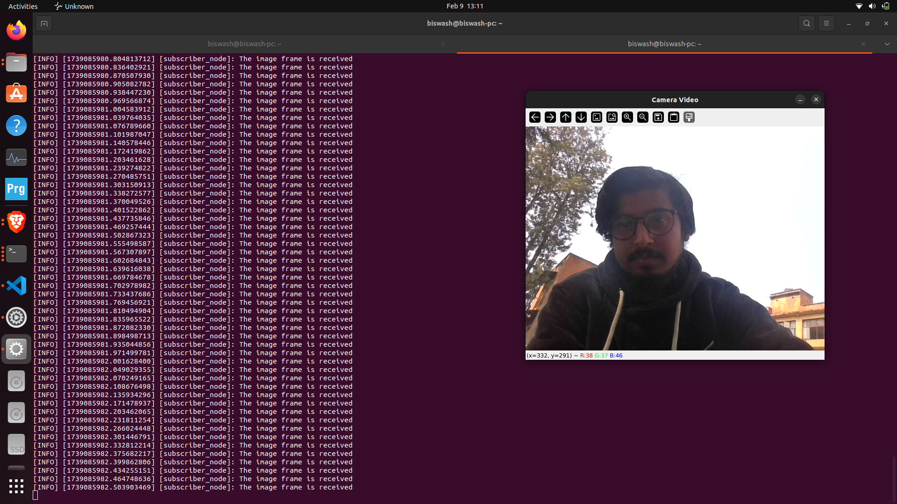

# Pre-requisites

```bash
# Install kamoso
biswash@biswash-pc:~$ sudo apt install kamoso
```


```bash
biswash@biswash-pc:~$ ls /dev/ | grep video
video0
video1
```


```bash 
# Check the Following Packages
biswash@biswash-pc:~$ pkg-config --modversion opencv4 
4.5.4
biswash@biswash-pc:~$ pkg-config --modversion opencv4 ^C
biswash@biswash-pc:~$ ros2 pkg prefix rclpy
/opt/ros/humble
biswash@biswash-pc:~$ ros2 pkg prefix image_transport 
/opt/ros/humble
biswash@biswash-pc:~$ ros2 pkg prefix cv_bridge 
/opt/ros/humble
biswash@biswash-pc:~$ ros2 pkg prefix sensor_msgs
/opt/ros/humble
biswash@biswash-pc:~$ ros2 pkg prefix std_msgs 
/opt/ros/humble
```


```bash
# Make the directory and clone the repo 
biswash@biswash-pc:~$ mkdir -p ~/ws_ros2_camera/src
biswash@biswash-pc:~$ cd ws_ros2_camera/
biswash@biswash-pc:~/ws_ros2_camera$ ls 
src
biswash@biswash-pc:~/ git clone https://github.com/20-wash/laptop_camera_and_ros2.git
biswash@biswash-pc:~/ws_ros2_camera$ colcon build 
                     
biswash@biswash-pc:~/ws_ros2_camera$ ls 
build  install  log  src
```

```bash
# Source the workspace
biswash@biswash-pc:~$ source ~/ws_ros2_camera/install/setup.bash
```


```bash
# Run the publisher node in terminal 1: 
biswash@biswash-pc:~$ ros2 run ros2_opencv publisher_node 
```

```bash
# Run the subscriber node in terminal 2: 
biswash@biswash-pc:~$ ros2 run ros2_opencv subscriber_node 
```


